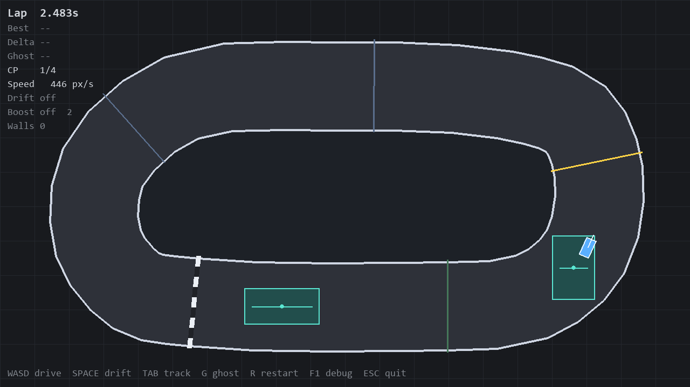

<div align="center">

# Ghostline

**A deterministic 2D racer where a PPO agent learned a 3.948s lap, beating the human benchmark by 0.011s.**

[](https://www.python.org/)
[](https://pyga.me/)
[](docs/RL_EXPERIMENT_LOG.md)
[](LICENSE)

[Case study](https://michaelreinhoffer.lol/work/ghostline) · [Architecture](docs/PROJECT_STATE.md) · [Experiment log](docs/RL_EXPERIMENT_LOG.md)

</div>

<p align="center">
  
</p>

<p align="center"><em>The same physics core powers human play, exact replays, evaluation, and PPO training.</em></p>

## The result

| AI policy | Human benchmark | Winning margin | Wall hits |
| ---: | ---: | ---: | ---: |
| **3.948s** | 3.959s | **0.011s** | **0** |

The final policy is run `881229`: 238 control ticks on `track_01_easy_loop`. The result is not a prerecorded animation or a hand-authored racing line. It is a deterministic PPO rollout through the same simulator used by the playable game.

## Why Ghostline exists

Ghostline started with one constraint: **there must be only one version of the physics**.

Keyboard input and an RL policy both produce the same `Action`. The simulator advances at a fixed 120Hz, control updates happen at 60Hz, and rendering interpolates between states. Given the same starting state and action stream, the same lap can be reproduced exactly.

That single seam makes the project several things at once:

- A top-down time-trial racer with drift, boost pads, checkpoints, and a live ghost delta.
- A Gymnasium-style environment that does not maintain a separate training approximation.
- A replay system that stores inputs and rebuilds the run from simulation state.
- An evaluation harness with deterministic rollouts, ranked artifacts, and trace comparisons.

```text
Keyboard ─┐
          ├─> Action ─> fixed-step simulator ─┬─> Pygame renderer
PPO policy┘                                  ├─> replay recorder
                                             └─> evaluation + analytics
```

## From wall-stalls to a winning lap

The useful part was not simply training PPO until a number went down. The experiment log records the failed reward designs and regressions too.

| Stage | Best result | What changed |
| --- | ---: | --- |
| Early reward shaping | Stalled before a full lap | Direct checkpoint seeking created repeatable wall attractors. |
| First valid policy | ~7.50s | Removing the wall-line tax let the policy commit to finishing. |
| Time-attack curriculum | 5.15s | Fine-tuning a known finisher worked better than restarting the seed lottery. |
| Keep-best training | 4.75s | Preserving the strongest evaluation checkpoint stopped final-weight regression. |
| Final policy | **3.948s** | Lookahead and wall-sensor observations closed the remaining corner-speed gap. |

The full progression, including model names, seeds, reward versions, and failed runs, is in [`docs/RL_EXPERIMENT_LOG.md`](docs/RL_EXPERIMENT_LOG.md).

## Quick start

Requires Python 3.11 or newer.

```bash
git clone https://github.com/mreinhofferxd-pixel/Ghostline2DRacerRL.git
cd Ghostline2DRacerRL
python -m pip install -e ".[dev]"
python -m momentum_lab.main
```

### Controls

| Input | Action |
| --- | --- |
| `WASD` / arrows | Drive |
| `Space` | Drift |
| `G` | Toggle ghost |
| `R` | Restart |
| `F1` | Debug view |
| `F11` | Toggle fullscreen |
| `Esc` | Quit |

In debug view, the white line is heading and the green line is velocity. The angle between them is the drift.

## Test and evaluate

```bash
python -m pytest -q
python -m momentum_lab.eval
```

For RL dependencies:

```bash
python -m pip install -e ".[train]"
```

## Project map

```text
momentum_lab/
├── core/       deterministic physics, collision, checkpoints, timing
├── render/     Pygame rendering and debug views
├── replay/     recording, storage, playback, and ghost interpolation
├── rl/         environment, observations, rewards, PPO training, analytics
├── eval/       reproducible evaluation harness
└── tracks/     track loading and validation
tests/          determinism, physics, replay, RL, and analytics coverage
runs/           generated previews and experiment artifacts
```

For the current architecture and exact benchmark references, see [`docs/PROJECT_STATE.md`](docs/PROJECT_STATE.md).

## Scope

Ghostline currently ships one generated track, `track_01_easy_loop`. It is a focused simulation and reinforcement-learning project, not a finished commercial racing game. Menus, audio, controller support, and broader content are deliberately outside the current result.

## License

[MIT](LICENSE)

